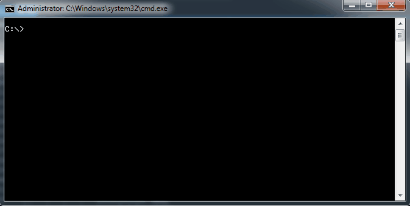

# RainbowWorm
Draws a rainbow coloured worm (Sine wave) to the console.

## Download

Download it [here](https://github.com/Killeroo/RainbowWorm/releases)

## Usage

Run without arguments to use default 'worm body' or provide an argument to change text: 

`
RainbowWorm BlisteringBarnicales 
`
`
RainbowWorm "some text"
`

Use ctrl-c to stop.
